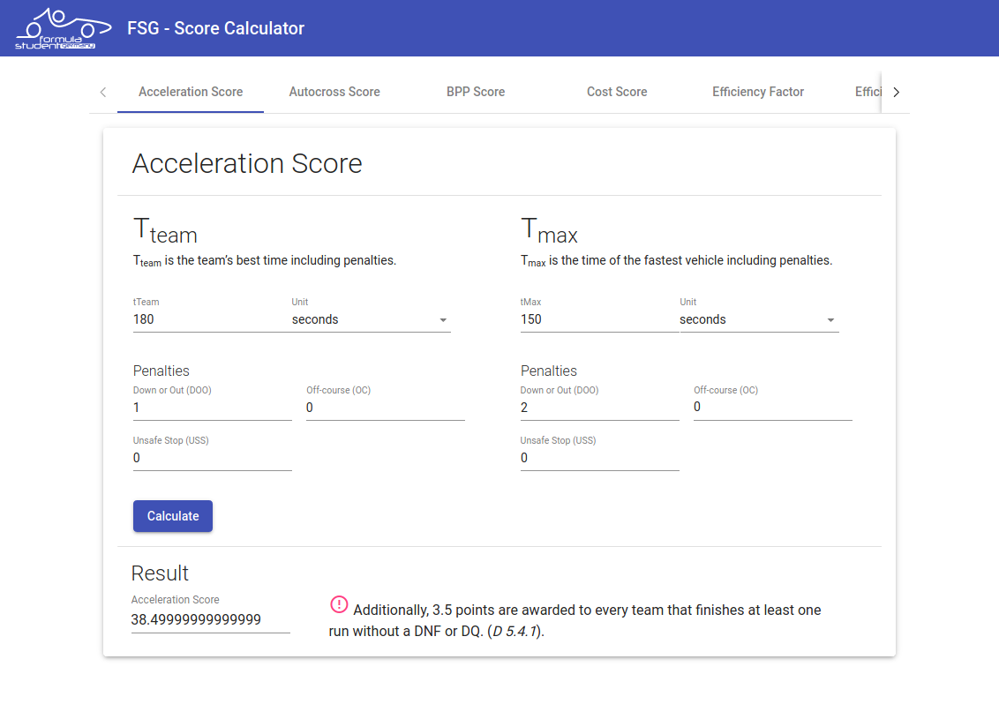

# Formula Student Germany (FSG) Score Calculator

This application provides a simple user interface for calculating all scores that are part of Formula Student Germany (FSG) rules. The calculations are based on the formulas specified in [FSG rules 2020 version 1.0](https://www.formulastudent.de/fsg/rules/). The application is based on Angular 8.3.23 and uses [Angular Material](https://material.angular.io/).

The calculation of the following scores has been implemented:

* Acceleration Score
* Autocross Score
* Business Plan Presentation (BPP) Score
* Cost Score
* Efficiency Factor
* Efficiency Score
* Endurance Score
* Skidpad Score

:warning: We can neither guarantee correctness nor completeness of the calculates scores. Please keep in mind that the faulty operation of this application can lead to incorrect scores.



## Development

Run `ng serve` for a dev server. Navigate to `http://localhost:4200/`. The app will automatically reload if you change any of the source files.

```bash
npm install -g @angular/cli@8.3.23
cd fsg-scores/
npm install
ng serve
```

## Deployment

You can either use Docker Compose or Docker directly for building and deploying this application. Docker Compose will automatically build the Docker Image, if it hasn't been built before. Navigate to `http://localhost:8080/` to access the app. 

* Docker:
  ```bash
  docker build -t fsg-scores:latest .
  docker run -p 8080:80 fsg-scores:latest
  ```

* Docker Compose:
  ```bash
  docker-compose up
  ```

## License

Copyright 2020 Philipp Perez

Permission is hereby granted, free of charge, to any person obtaining a copy of this software and associated documentation files (the "Software"), to deal in the Software without restriction, including without limitation the rights to use, copy, modify, merge, publish, distribute, sublicense, and/or sell copies of the Software, and to permit persons to whom the Software is furnished to do so, subject to the following conditions:

The above copyright notice and this permission notice shall be included in all copies or substantial portions of the Software.

THE SOFTWARE IS PROVIDED "AS IS", WITHOUT WARRANTY OF ANY KIND, EXPRESS OR IMPLIED, INCLUDING BUT NOT LIMITED TO THE WARRANTIES OF MERCHANTABILITY, FITNESS FOR A PARTICULAR PURPOSE AND NONINFRINGEMENT. IN NO EVENT SHALL THE AUTHORS OR COPYRIGHT HOLDERS BE LIABLE FOR ANY CLAIM, DAMAGES OR OTHER LIABILITY, WHETHER IN AN ACTION OF CONTRACT, TORT OR OTHERWISE, ARISING FROM, OUT OF OR IN CONNECTION WITH THE SOFTWARE OR THE USE OR OTHER DEALINGS IN THE SOFTWARE.